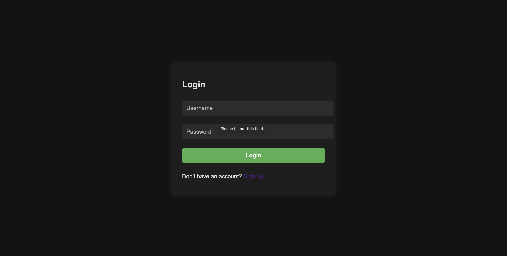
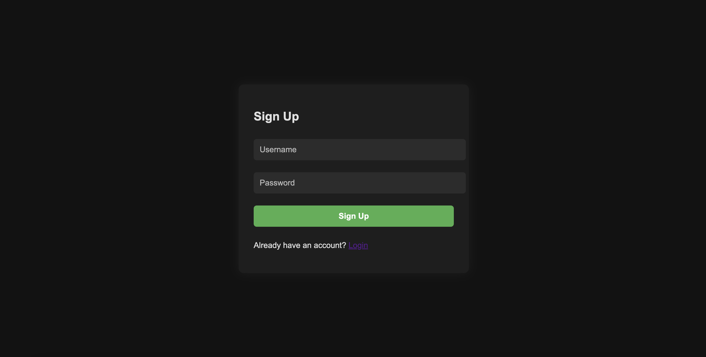
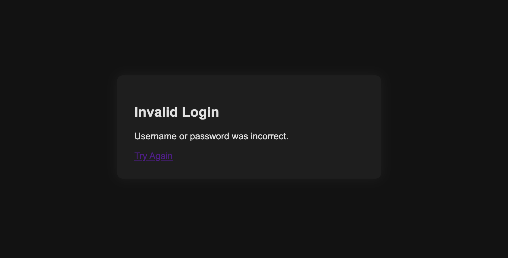

# Login Project

A simple web application in Go that provides user authentication with signup, login, logout, and session management. It uses SQLite for storage and bcrypt for password hashing.

## Features
- User registration (signup)
- User login and logout
- Session management with cookies
- Passwords securely hashed with bcrypt
- SQLite database for user and session storage
- Simple, modern UI with dark mode styling

## Screenshots

---

---

---

---


## Project Structure
```
Login-project/
├──main.go           
└──go.mod             
  static/
  └──style.css     
  templates/           
  ├──signup.html        
  ├──login.html
  ├──exists.html          
  ├──welcome.html       
  └──invalid.html    
```

## Getting Started

### Prerequisites
- Go 1.24+

### Install dependencies
```
go mod tidy
```

### Run the application
```
go run main.go
```

The server will start at [http://localhost:8080](http://localhost:8080)

### Usage
1. Visit `/signup` to create a new account.
2. Login at `/login`.
3. On successful login, you are redirected to `/welcome`.
4. Use the logout button to end your session.

## Database
- SQLite database file `users.db` is created automatically.
- Two tables: `users` (username, password), `sessions` (session_id, username, expires).

## Dependencies
- [github.com/mattn/go-sqlite3](https://github.com/mattn/go-sqlite3) — SQLite driver
- [golang.org/x/crypto/bcrypt](https://pkg.go.dev/golang.org/x/crypto/bcrypt) — Password hashing
- [github.com/google/uuid](https://github.com/google/uuid) — Session IDs

## Security Notes
- Passwords are hashed before storage.
- Sessions expire after 24 hours.
